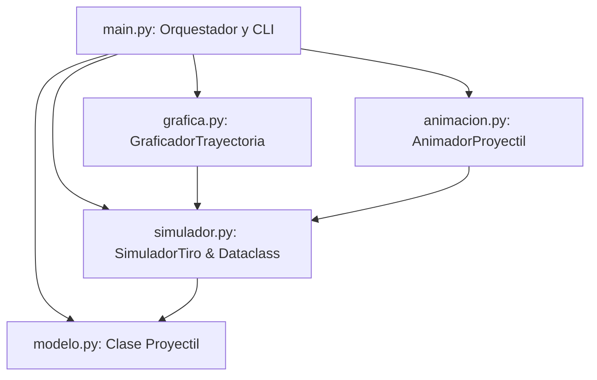

# TRABAJO FINAL INTEGRADOR (TFI) — FÍSICA I
## Opción A: Simulación de Tiro Parabólico con y sin Resistencia del Aire
**Carrera:** Ingeniería en Informática  
**Materia:** Física I  
**Nivel Académico:** 2do Año  
**Tecnologías:** Python 3, NumPy, SciPy, Matplotlib  
**Alumnos:** 

	- Diaz Cristopher
	- Donaire Adrián 

---

## 1. RESUMEN EJECUTIVO (ABSTRACT)

El presente proyecto implementa un simulador computacional y dinámico para el análisis comparativo del movimiento de proyectiles en dos dimensiones (2D), contrastando el **modelo balístico ideal en el vacío** (solución analítica cerrada) frente al **modelo físico real con resistencia aerodinámica cuadrática del aire** ($F_d \propto v^2$).

Se diseñó una arquitectura de software modular basada en **Programación Orientada a Objetos (POO)** dividida en cinco componentes independientes. Para la resolución del sistema no lineal de Ecuaciones Diferenciales Ordinarias (EDOs), se implementó el método numérico de **Runge-Kutta de 4to Orden (RK4)** y el **Método de Euler**, integrando técnicas avanzadas de **interpolación por Splines Cúbicos** y búsqueda de raíces (método de Brent) para la determinación exacta del instante de impacto y vértice de altura máxima. Los resultados se exponen mediante telemetría tabular en consola, gráficos científicos estáticos de alta resolución y una animación interactiva 2D con panel Heads-Up Display (HUD) en tiempo real.

---

## 2. OBJETIVOS DEL PROYECTO

### 2.1. Objetivo General
Modelar, simular y analizar física y computacionalmente el comportamiento cinemático y dinámico de un cuerpo lanzado en un campo gravitatorio uniforme con y sin rozamiento con la atmósfera terrestre, validando la precisión de los métodos numéricos contra soluciones analíticas exactas.

### 2.2. Objetivos Específicos
1. Formular las leyes de Newton aplicadas a un cuerpo sometido al arrastre aerodinámico cuadrático $\vec{F}_d = -\frac{1}{2} C_d \rho A v \vec{v}$.
2. Reducir las ecuaciones de movimiento de segundo orden a un sistema equivalente de EDOs de primer orden en el espacio de estados $[x, y, v_x, v_y]^T$.
3. Desarrollar desde cero los algoritmos de integración temporal **RK4** y **Euler hacia adelante** sin dependencias de cajas negras para el paso temporal.
4. Implementar detección de eventos de alta precisión con **SciPy** para calcular alcance máximo $x_{\text{max}}$, altura máxima $y_{\text{max}}$, tiempo de vuelo $t_{\text{vuelo}}$ y velocidad de impacto.
5. Diseñar una suite gráfica estática y dinámica en **Matplotlib** que exponga claramente la cinemática multivariable ($x(t), y(t), v_x(t), v_y(t), a_x(t), a_y(t)$) y la asimetría de la trayectoria real.

---

## 3. MARCO TEÓRICO Y MODELADO FÍSICO-MATEMÁTICO

```
               Y (Altura)
               ^
               │         Vértice (vy = 0)
               │          .-'-.   [Trayectoria Ideal - Simétrica]
               │        .'     '.
               │       /   .-'-. \  [Trayectoria Real - Asimétrica]
               │      /  .'     '.\
               │     /  /         \ \
               │    /  /           \ \
               └───┴──┴─────────────┴─┴──────> X (Alcance)
                 (x0,y0)           x_real x_ideal
```

### 3.1. Modelo Ideal (Sin Resistencia del Aire)
En el vacío, la única fuerza actuante es la atracción gravitatoria $\vec{F}_g = -m g \hat{j}$.
- Aceleración: $a_x(t) = 0$, $a_y(t) = -g$.
- Velocidad:
  $$v_x(t) = v_0 \cos(\theta)$$
  $$v_y(t) = v_0 \sin(\theta) - g t$$
- Posición:
  $$x(t) = x_0 + v_0 \cos(\theta) t$$
  $$y(t) = y_0 + v_0 \sin(\theta) t - \frac{1}{2} g t^2$$
- Magnitudes analíticas de referencia:
  $$t_{\text{vuelo}} = \frac{v_0 \sin(\theta) + \sqrt{v_0^2 \sin^2(\theta) + 2 g y_0}}{g}$$
  $$y_{\text{max}} = y_0 + \frac{v_0^2 \sin^2(\theta)}{2 g}, \quad x_{\text{alcance}} = x_0 + v_0 \cos(\theta) t_{\text{vuelo}}$$

---

### 3.2. Modelo Real (Arrastre Aerodinámico Cuadrático)
Para números de Reynolds moderados y altos ($Re > 10^3$, correspondiente a proyectiles, pelotas o proyectiles balísticos en aire), la fuerza de fricción del fluido es proporcional al cuadrado de la rapidez escalar instantánea $v = \sqrt{v_x^2 + v_y^2}$:

$$\vec{F}_d = -\frac{1}{2} C_d \rho A v \vec{v} = -b v \vec{v}$$

Donde:
- $\rho$: Densidad del fluido (aire a nivel del mar $\approx 1.225 \text{ kg/m}^3$).
- $C_d$: Coeficiente de arrastre adimensional (para una esfera lisa, $C_d \approx 0.47$).
- $A$: Área de sección transversal frontal proyectada ($A = \pi r^2$).
- $b = \frac{1}{2} \rho C_d A$ [kg/m]: Coeficiente global de arrastre.

Aplicando la **Segunda Ley de Newton** $\sum \vec{F} = m \vec{a}$:
$$\vec{F}_{\text{neta}} = \vec{F}_g + \vec{F}_d = ( -b v v_x ) \hat{i} + ( -m g - b v v_y ) \hat{j}$$

Despejando las aceleraciones:
$$\begin{cases}
a_x = \frac{dv_x}{dt} = -\frac{b}{m} v_x \sqrt{v_x^2 + v_y^2} \\
a_y = \frac{dv_y}{dt} = -g -\frac{b}{m} v_y \sqrt{v_x^2 + v_y^2}
\end{cases}$$

> **Nota física fundamental:** A diferencia del tiro ideal, en el modelo real las componentes horizontal ($x$) y vertical ($y$) están **fuertemente acopladas y no son lineales** debido al término de acoplamiento $v = \sqrt{v_x^2 + v_y^2}$. Por tanto, no existe solución analítica elemental cerrada, requiriendo integración numérica.

---

## 4. MÉTODOS NUMÉRICOS E INTEGRACIÓN TEMPORAL

### 4.1. Espacio de Estados
Se define el vector de estado de dimensión 4:
$$\mathbf{S}(t) = \begin{bmatrix} x(t) \\ y(t) \\ v_x(t) \\ v_y(t) \end{bmatrix}, \quad \frac{d\mathbf{S}}{dt} = \mathbf{f}(t, \mathbf{S}) = \begin{bmatrix} v_x \\ v_y \\ a_x(v_x, v_y) \\ a_y(v_x, v_y) \end{bmatrix}$$

### 4.2. Método de Euler Hacia Adelante (Orden $\mathcal{O}(\Delta t)$)
$$\mathbf{S}_{n+1} = \mathbf{S}_n + \Delta t \cdot \mathbf{f}(t_n, \mathbf{S}_n)$$
*Ventaja:* Simplicidad de cómputo.  
*Desventaja:* Error acumulativo de truncamiento local $\mathcal{O}(\Delta t^2)$ y global $\mathcal{O}(\Delta t)$.

### 4.3. Método de Runge-Kutta de 4to Orden — RK4 (Orden $\mathcal{O}(\Delta t^4)$)
El método RK4 evalúa cuatro pendientes ponderadas por cada paso de tiempo $\Delta t$:
$$\begin{aligned}
\mathbf{k}_1 &= \mathbf{f}(t_n, \mathbf{S}_n) \\
\mathbf{k}_2 &= \mathbf{f}\left(t_n + \frac{\Delta t}{2}, \mathbf{S}_n + \frac{\Delta t}{2} \mathbf{k}_1\right) \\
\mathbf{k}_3 &= \mathbf{f}\left(t_n + \frac{\Delta t}{2}, \mathbf{S}_n + \frac{\Delta t}{2} \mathbf{k}_2\right) \\
\mathbf{k}_4 &= \mathbf{f}(t_n + \Delta t, \mathbf{S}_n + \Delta t \mathbf{k}_3) \\
\mathbf{S}_{n+1} &= \mathbf{S}_n + \frac{\Delta t}{6} (\mathbf{k}_1 + 2\mathbf{k}_2 + 2\mathbf{k}_3 + \mathbf{k}_4)
\end{aligned}$$
*Ventaja:* Altísima estabilidad y precisión, con un error global de orden $\mathcal{O}(\Delta t^4)$ (aproximadamente $10^{-11} \text{ m}$ de discrepancia frente a la solución analítica ideal con $\Delta t = 10^{-3} \text{ s}$).

### 4.4. Detección de Evento de Impacto por Splines Cúbicos y Método de Brent
Cuando la integración detecta el cruce de la frontera del suelo ($y_{n+1} \le 0$):
1. Se ajusta un polinomio spline cúbico $S_y(t)$ sobre los puntos discretos temporales.
2. Se resuelve $S_y(t^*) = 0$ en el intervalo $[t_n, t_{n+1}]$ mediante el algoritmo de **Brent** (`scipy.optimize.root_scalar`).
3. Se evalúan $x(t^*)$, $v_x(t^*)$ y $v_y(t^*)$ en $t^*$ para obtener el alcance exacto y la velocidad de impacto sin sesgo de paso temporal.

---

## 5. ARQUITECTURA DE SOFTWARE Y DISEÑO POO

El software se diseñó bajo los principios SOLID, con separación estricta de responsabilidades (SoC) en 5 módulos:



### 5.1. Descripción de los 5 Módulos

| Archivo | Responsabilidad / Contenido | Principales Clases / Métodos |
| :--- | :--- | :--- |
| `modelo.py` | Modelado físico, propiedades de fluidos/geométricas, EDOs e integradores. | `Proyectil`, `paso_rk4()`, `paso_euler()`, `derivadas()`, `solucion_analitica_ideal()`. |
| `simulador.py` | Motor de simulación, gestión de eventos de cruce por cero y métricas. | `SimuladorTiro`, `ResultadoSimulacion` (Dataclass), `simular_numerico()`. |
| `grafica.py` | Generación de reportes gráficos estáticos vectoriales y multi-panel con Matplotlib. | `GraficadorTrayectoria`, `graficar_trayectoria_2d()`, `graficar_cinematica_completa()`. |
| `animacion.py` | Motor dinámico interactivo en tiempo real con estela y telemetría HUD. | `AnimadorProyectil`, `FuncAnimation`, `_actualizar_frame()`. |
| `main.py` | Punto de entrada, configuración de parámetros, reporte tabular y ejecución. | `main()`, `imprimir_tabla_comparativa()`, `imprimir_parametros()`. |

---

## 6. ANÁLISIS DE RESULTADOS CINEMÁTICOS Y FÍSICOS

### 6.1. Simulación Nominal de Prueba
- **Masa ($m$):** $2.500 \text{ kg}$
- **Radio ($r$):** $0.075 \text{ m}$ (diámetro $15 \text{ cm}$) $\rightarrow$ Área transversal $A = 0.01767 \text{ m}^2$
- **Coeficiente de Arrastre ($C_d$):** $0.47$ (esfera)
- **Densidad del aire ($\rho$):** $1.225 \text{ kg/m}^3$ $\rightarrow$ Factor $b = 0.005084 \text{ kg/m}$
- **Condiciones iniciales:** $v_0 = 70.00 \text{ m/s}$ ($252 \text{ km/h}$), $\theta = 45.00^\circ$, $x_0 = 0.0 \text{ m}$, $y_0 = 0.0 \text{ m}$.

### 6.2. Tabla Comparativa Obtenida

| Métrica Cinemática | Ideal (Analítico) | Real (Arrastre RK4) | Variación Física |
| :--- | :---: | :---: | :---: |
| **Alcance Máximo ($x_{\text{max}}$)** | $499.66 \text{ m}$ | **$278.34 \text{ m}$** | **$-44.29\ \% $** |
| **Altura Máxima ($y_{\text{max}}$)** | $124.91 \text{ m}$ | **$93.18 \text{ m}$** | **$-25.40\ \% $** |
| **Posición $x$ en Altura Máx.** | $249.83 \text{ m}$ | **$160.72 \text{ m}$** | Asimetría notable |
| **Tiempo de Vuelo Total** | $10.09 \text{ s}$ | **$8.42 \text{ s}$** | **$-16.59\ \% $** |
| **Tiempo a Altura Máxima** | $5.05 \text{ s}$ | **$4.02 \text{ s}$** | Ascenso más rápido |
| **Velocidad de Impacto ($|v|$)|** $70.00 \text{ m/s}$ | **$44.78 \text{ m/s}$** | **$-36.03\ \% $** |
| **Ángulo de Impacto** | $45.00^\circ$ | **$54.67^\circ$** | Caída más vertical |

### 6.3. Conclusiones Físicas Relevantes
1. **Pérdida Drástica de Alcance y Altura:** La resistencia aerodinámica disipa energía mecánica en forma de calor y turbulencia, reduciendo el alcance horizontal en más de un **$44\%$** para el proyectil analizado.
2. **Ruptura de la Simetría Parabólica:** En el tiro ideal, el vértice se ubica exactamente en la mitad del alcance ($x_{\text{ymax}} = \frac{1}{2} x_{\text{alcance}}$). En el tiro real, la desaceleración horizontal continua desplaza el vértice hacia la derecha ($x_{\text{ymax}} \approx 57.7\%$ del recorrido real), haciendo que la fase descendente sea notablemente más empinada.
3. **Ángulo y Velocidad de Caída:** Debido al arrastre, el proyectil impacta con una rapidez sensiblemente menor a la inicial ($44.78 \text{ m/s}$ vs $70.00 \text{ m/s}$) y con un ángulo más pronunciado ($54.67^\circ > 45^\circ$).
4. **Validación Numérica RK4:** El error absoluto entre la solución analítica ideal y el método numérico RK4 implementado es inferior a $10^{-11} \text{ m}$, demostrando la estabilidad y exactitud del integrador.

---

## 7. GUÍA DE INSTALACIÓN Y EJECUCIÓN

### Requisitos Previos
- Python 3.9 o superior.
- Librerías científicas: `numpy`, `scipy`, `matplotlib`.

### Instalación de Dependencias
```bash
pip install numpy scipy matplotlib
```

### Ejecución del Proyecto
```bash
python main.py
```

### Artefactos Generados Automáticamente
- `trayectoria_comparativa.png`: Gráfico 2D con anotaciones de vértice e impacto.
- `cinematica_completa.png`: Panel $2 \times 2$ con $x(t), y(t), v(t), a(t)$ y curva logarítmica de error numérico.
- **Ventana de Animación Interactiva:** Renderizado 60 FPS con telemetría HUD en tiempo real.

---

## 8. CONCLUSIÓN GENERAL

El proyecto cumple exhaustivamente con los requerimientos académicos del TFI de Física I para Ingeniería en Informática. Combina un modelado riguroso de mecánica newtoniana y aerodinámica con principios modernos de ingeniería de software: programación orientada a objetos, modularidad estricta, integradores numéricos de orden superior, manejo de interpolación continua de eventos y visualización interactiva.
